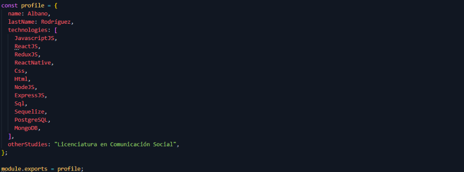

### Hola a todos! 👋

Mi nombre es Albano, soy Comunicador Social y un apasionado por la tecnología y la programación. Me gusta mucho trabajar en equipo y estar en constante aprendizaje. Tengo como hobbies la fotografía y la escritura, actividades que me ayudan al esparcimiento. En cuanto a mis herramientas laborales en el mundo de la programación mis fortalezas se encuentran en el uso de JavaScript, ReactJS, ReduxJS, React Native, Node, Postgress, Sequelize, y mongoDB entre otros.

<!--
**bano0224/bano0224** is a ✨ _special_ ✨ repository because its `README.md` (this file) appears on your GitHub profile.

Here are some ideas to get you started:

- 🔭 I’m currently working on ...
- 🌱 I’m currently learning ...
- 👯 I’m looking to collaborate on ...
- 🤔 I’m looking for help with ...
- 💬 Ask me about ...
- 📫 How to reach me: ...
- 😄 Pronouns: ...
- ⚡ Fun fact: ...
-->
